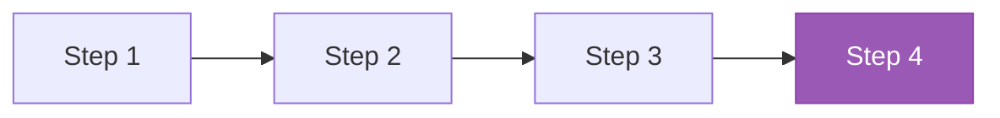
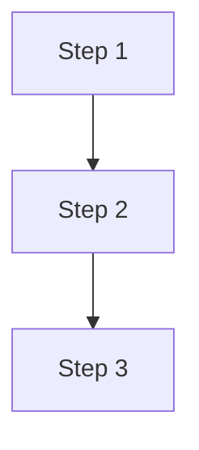
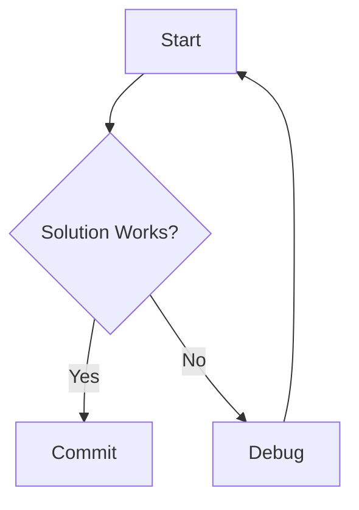
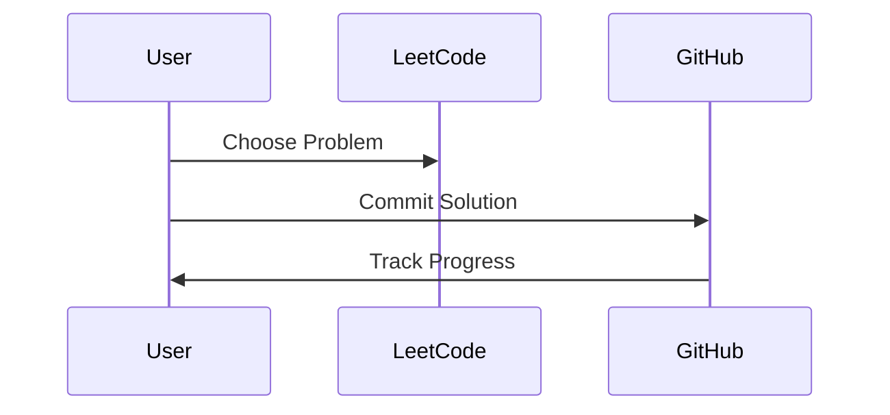

# Logo and Diagram Documentation

This document provides instructions for using the Daily Challenge logo generator and the Mermaid diagram included in this repository.

## 1. Logo Generator

### Overview
The `generate_logo.py` script creates a simple, customizable logo for the Daily Challenge repository. The logo features:
- A gradient background (blue to purple by default)
- "Daily Challenge" text in a bold, readable font
- Decorative star icons
- Professional appearance suitable for GitHub repositories

### Prerequisites
- Python 3.x
- Pillow library

### Installation
Install the required Pillow library:
```bash
pip install Pillow
```

### Usage
Run the script from the repository root:
```bash
python3 generate_logo.py
```

This will generate a file named `daily_challenge_logo.png` (800x400 pixels) in the current directory.

### Customization
You can customize the logo by editing the following parameters in `generate_logo.py`:

#### Colors
```python
color_start = (41, 128, 185)   # Starting gradient color (Blue)
color_end = (142, 68, 173)     # Ending gradient color (Purple)
text_color = (255, 255, 255)   # Text color (White)
star_color = (241, 196, 15)    # Star icon color (Gold)
```

#### Dimensions
```python
generate_logo(output_file='daily_challenge_logo.png', width=800, height=400)
```

#### Text Content
Modify the text in the `generate_logo()` function:
```python
text1 = "Daily"
text2 = "Challenge"
```

#### Star Positions
Adjust the positions of decorative stars:
```python
star_positions = [
    (100, 80),    # Top-left
    (700, 100),   # Top-right
    (120, 320),   # Bottom-left
    (680, 340)    # Bottom-right
]
```

### Adding the Logo to README
Once generated, you can add the logo to your README.md:
```markdown

```

**Note:** The generated logo file is excluded from version control via `.gitignore`. Each user can generate their own customized version locally.

---

## 2. Mermaid Diagram

### Overview
The README.md includes a Mermaid.js diagram that visualizes the daily challenge workflow with three key steps. The diagram is interactive and includes clickable links.

### Viewing the Diagram
The diagram is automatically rendered on GitHub when viewing the README.md file. It shows:
1. **Step 1: Choose Problem** - Links to LeetCode problem set
2. **Step 2: Solve & Code** - Links to this repository
3. **Step 3: Test & Document** - Links to commit history

### Customizing the Diagram

#### Changing the Text
Edit the node labels in the Mermaid code block:
```mermaid
A[Step 1: Your Custom Text] --> B[Step 2: Your Custom Text]
B --> C[Step 3: Your Custom Text]
```

#### Updating Links
Modify the `click` directives to point to your preferred URLs:
```mermaid
click A "https://your-url.com" "Your tooltip text"
click B "https://your-url.com" "Your tooltip text"
click C "https://your-url.com" "Your tooltip text"
```

#### Changing Colors
Adjust the `style` directives to customize node appearance:
```mermaid
style A fill:#3498db,stroke:#2980b9,color:#fff
style B fill:#e74c3c,stroke:#c0392b,color:#fff
style C fill:#2ecc71,stroke:#27ae60,color:#fff
```

Color format: `fill:#RRGGBB` (hex color code)

#### Adding More Steps
Extend the workflow by adding more nodes:


### Diagram Types
Mermaid supports various diagram types. Here are some alternatives:

#### Vertical Flow


#### Flowchart with Decision


#### Sequence Diagram


### Additional Resources
- [Mermaid.js Documentation](https://mermaid.js.org/)
- [Mermaid Live Editor](https://mermaid.live/) - Test your diagrams online
- [GitHub Mermaid Support](https://github.blog/2022-02-14-include-diagrams-markdown-files-mermaid/)

---

## Summary

Both the logo generator and Mermaid diagram are designed to be simple, customizable proof-of-concept implementations that you can refine to match your specific needs. Feel free to experiment with different colors, layouts, and content to create a personalized daily challenge experience!
